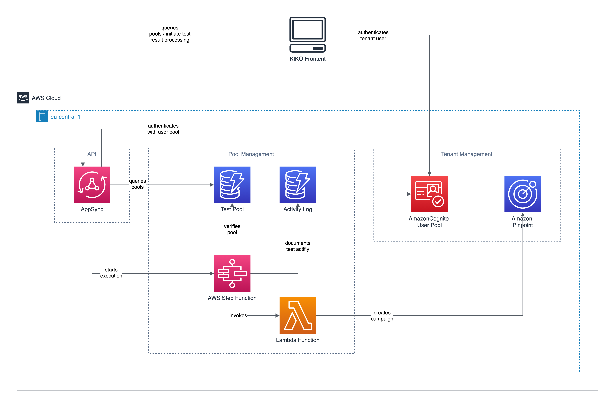

# KIKO Backend

[](./CODE_OF_CONDUCT.md)
[](https://github.com/prettier/prettier)
[](https://github.com/sponsors/cremich)
[](https://www.paypal.com/pools/c/8yGs7i3cOe)

Welcome to the KIKO Backend 👋 This repository provides all backend and infrastructure components for the KIKO-App.

## 🔬 About KIKO

The name KIKO refers to the same named test project in the city of Cologne (Germany) based Kindergartens. Kiko (Kita Testung Köln) is a SARS-CoV-2 testing program for kindergartens and was developed by the Institute of Virology at the University Hospital of Cologne, Germany.

KiKo is based on the "lollipop method" and pool PCR testing.

The lollipop method is a non-invasive method of sample collection. In this method, participants have to suck on a swab - like a lollipop - for 30 seconds. These swabs can then be used to perform a PCR test. The swabs are tested in a pool, which means that one PCR is performed per testing group with the swabs of all participants. If the test result of the pool PCR is negative, it means that SARS-CoV-2 could not be detected in any of tested participants. If the result is positive, all participants must be retested individually to identify the infected person. To prevent infected persons from infecting others, they must remain at home until they are no longer infectious.

The KIKO-App is a serverless software solution running on AWS. It aims to support institutions like Kindergarten or schools to implement the pool testing in their environments. The KIKO-App supports to document test results and forward positive test results to the participants or their representatives.

## High Level Architecture



The main components of this solutions are `tenant-management`, `pool-management`, and the `api`.

### Tenant Management

The tenant management module is responsible to provide an Amazon Cognito user pool for user authentication and authorization. Further it provides dedicated Amazon Cognito user groups as well as an Amazon Pinpoint application per tenant. After the initial deployment, a demo tenant is automatically provisioned for you via the AWS CDK.

### Pool Management

Provides storage for test pool metadata and encapsulates the business logic for processing test results in an AWS Step Function workflow.

### API Layer

Provides an AWS Appsync GraphQL API for the KIKO frontend to query pools per tenant and initiate the test processing.

## Domain Story

After a successful login, the tenant manager will be taken to the start page with an overview of the active test pools of his tenant. Here the user has direct access to the two most important functions:

1. document a negative test result
2. forward a positive test result to the test pool recipients.

If the test result for a test pool is negative, the tenant manager can document the date and time of the test activity in the system. A negative test result does not trigger forwarding this information to the pool recipients. If the test result for a test pool is positive, the tenant manager can forward the information directly to the recipient group that is configured for a test pool. A positive test result is also documented in the system with date and time.

## 🚀 Getting Started

In order to install the backend on your local machine, please ensure to have the following tools available:

- AWS CLI v2
- Docker
- node.js v14 (LTS)
- npm v6 (bundled with node.js)

### Installation

First install the required dependencies using `npm`.

```sh
npm install
```

This will install everything you need to deploy the backend and make changes to the code. It will also include all required dev-dependencies like ESLint, CommitLint or Jest.

Please also follow the ["Getting started"](https://docs.aws.amazon.com/cdk/latest/guide/getting_started.html#getting_started_prerequisites) instructions on the official AWS CDK documentation to configure your local workstation accordingly. Run the following command to verify correct installation and print the version number of the AWS CDK.

```shell
cdk --version
```

If you do not want to install the CDK globally, you can also execute it via `npx` like shown in the following examples.

Once you have installed the AWS CDK successfully, you can bootstrap your AWS Account by running

```shell
npx cdk bootstrap
```

As the lambda functions are constructed using the [@aws-cdk/aws-lambda-nodejs module](https://docs.aws.amazon.com/cdk/api/latest/docs/aws-lambda-nodejs-readme.html), you will need to have Docker installed and running on your machine.

### Useful commands

- `npm run build` compile typescript to js
- `npm run watch` watch for changes and compile
- `npm run test` perform the jest unit tests
- `cdk deploy` deploy this stack to your default AWS account/region
- `cdk diff` compare deployed stack with current state
- `cdk synth` emits the synthesized CloudFormation template

## 🎉 Usage

### Deploy the application

If you'd like to receive email notifications for cloudwatch alarms (which is recommendable) provide your admin address at deploy time.

```shell
export ALERT_EMAIL_ADDRESS=admin@example.com
```

To deploy the stack using AWS CloudFormation, simply run

```shell
npx cdk deploy --outputs-file output.json
```

This will start the deployment process and create or update your environemnt. The CDK asks for approval on any IAM or security-group-related changes by default. You will be asked to confirm the changes before they are actually executed in your AWS account.
CDK will write all AWS Cloudformation outputs into a file if you set the `--outputs.file` option. We will use the outputs during the following environment setup tasks. The output will look similar to this:

```json
{
  "dev-kiko-app": {
    "pinpointapplicationid": "thisiscompletelyrandom",
    "projectregion": "eu-central-1",
    "testresultworkflowarn": "arn:aws:states:eu-central-1:1234567890:stateMachine:testresultworkflowprocesstestresult",
    "cognitouserpoolid": "eu-central-1_thisiscompletelyrandom",
    "awsappsyncgraphqlEndpoint": "https://thisiscompletelyrandom.appsync-api.eu-central-1.amazonaws.com/graphql",
    "cognitowebclientid": "thisiscompletelyrandom",
    "cognitoregion": "eu-central-1"
  }
}
```

### Create a user for the demo tenant

Run the following command in your terminal to create a new user with an E-Mail of your choice. Please update the parameter `user-pool-id` and replace it with the corresponding deployment output. You find the `user-pool-id` in the deployment output with the key `dev-kiko-app.cognitouserpoolid`.

```shell
aws cognito-idp admin-create-user \
    --user-pool-id dev-kiko-app.cognitouserpoolid \
    --username me@example.com \
    --user-attributes Name=email,Value=me@example.com \
    --desired-delivery-mediums EMAIL
```

Verify the creation step by opening your inbox and check if you received the invitation mail with the subject `Deine Einladung für die KiKo-App!`.

Next assign your newly created user to the demo tenant cognito group.

```shell
aws cognito-idp admin-add-user-to-group --user-pool-id dev-kiko-app.cognitouserpoolid --username me@example.com --group-name demo
```

### Create an endpoint in pinpoint to receive test results

Insert the application-id of the demo pinpoint application from the deployment output in the following command to create an endpoint that is part of all three initialized test groups. Please also ensure to update the `Address` attribute with your mobile phone number. A unique endpoint id is also required. Choose a random string or use the mobile phone number here as well.

```shell
aws pinpoint update-endpoint \
 --application-id dev-kiko-app.demopinpointapplicationid \
 --endpoint-id test-endpoint \
 --endpoint-request '{"ChannelType": "SMS", "Address": "+4912345678","Attributes": {"Group": ["Alpha","Beta","Gamma"],"Tenant": ["demo"]} }'
```

Note that your account might need a service limit increase before you'll be able to have SMS sent out.
This can be done [via the AWS Support](https://console.aws.amazon.com/support/cases#/create?issueType=service-limit-increase&limitType=service-code-sns-text-messaging).

### Process test results

One option to trigger the test result processing is to start an AWS Step Function execution with the following command.

```shell
aws stepfunctions start-execution \
  --state-machine-arn dev-kiko-app.testresultworkflowarn \
  --input "{\"tenant\":\"demo\",\"poolName\":\"Alpha\",\"testResult\":\"P\"}"
```

If your setup was successful, you should have receive an SMS from Amazon Pinpoint. You should also see a corresponding
campaign prefixed with `POOL_TEST_FWD_` in your Amazon Pinpoint campaign overview.

Only positive test results are forwarded to the pool recipients. In case of a negative test result, the activity is only logged in the activity log table for documentation purposes.

```shell
aws stepfunctions start-execution \
  --state-machine-arn dev-kiko-app.testresultworkflowarn \
  --input "{\"tenant\":\"demo\",\"poolName\":\"Alpha\",\"testResult\":\"N\"}"
```

## 🤝 Contributing

Contributions, issues and feature requests are welcome!

Feel free to check [issues page](https://github.com/cremich/kiko-backend/issues) for open issues or create one for feature
requests or if you have general questions.

Be also sure to review our [contributing guidelines](./CONTRIBUTING.md) and [code of conduct](./CODE_OF_CONDUCT.md).

## 🙏 Donation

We are very thankful if you decide to send us a donation. To ensure that we can cover the costs to provide the infrastructure for the KIKO app. To ensure that every Kindergarten in germany has access to the solution to implement the SARS-CoV-2 pool testings in their institutions. So that our kids and their families stay healthy! Please click on one of the

[](https://github.com/sponsors/cremich)
[](https://www.paypal.com/pools/c/8yGs7i3cOe)
